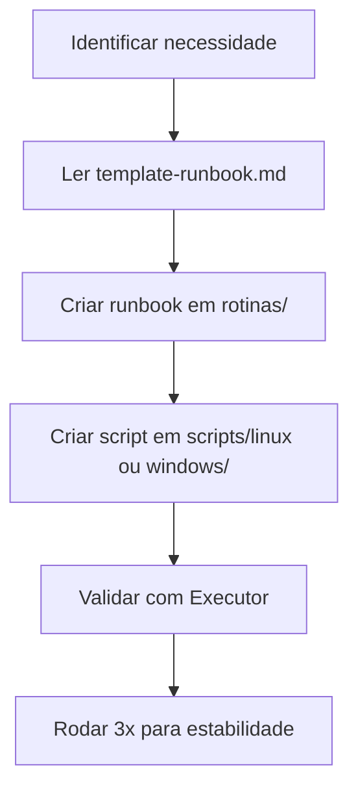

# 🧠 cerebrum/README — Guia do Sistema Cérebro & Executor

> **Objetivo:** Explicar como o sistema Cérebro ↔ Executor funciona  
> **Audiência:** Archimedes (Executor) + Humano (supervisor)  
> **Última atualização:** 2026-09-10

---

## 🎯 Visão Geral

| Componente | Tipo | Responsabilidade |
|------------|------|------------------|
| **Cérebro** | Modelos grandes (ex: `big-pickle`, `qwen3-coder:30b`) | Projeta Runbooks, scripts, rotinas |
| **Executor** | Modelos locais (ex: `qwen2.5-coder:7b`) | Executa Runbooks com 100% de consistência |

---

## 📂 Estrutura de Arquivos

```
cerebrum/
├── master-plan.md         # 🗺️ Plano diretor (Cérebro lê)
├── estrutura-cofre.md     # 🗂️ Árvore de diretórios (Cérebro lê)
├── template-runbook.md    # 📝 Template padrão (Cérebro usa)
├── README.md              # 📖 Este arquivo (Cérebro + Humano)
├── prompts/               # 📋 Prompts para o Executor
│   ├── prompt-executor-diario.md
│   └── prompt-executor-auditoria.md
├── rotinas/               # 📋 RUNBOOKS prontos (Executor lê)
│   ├── runbook-backup-limpeza.md
│   ├── runbook-git-sync.md
│   ├── runbook-auditoria-cofre.md
│   ├── runbook-backup-semanal.md
│   ├── runbook-saude-sistema.md
│   ├── runbook-delegacao.md
│   └── runbook-monitoramento.md
└── logs/                  # 🪵 Logs de execução (Executor escreve)
```

---

## 🧠 Como o Cérebro Deve Trabalhar

### 1. Leitura Obrigatória (Antes de Gerar Qualquer Coisa)

| Arquivo | Motivo |
|---------|--------|
| `AGENTS.md` | Interface IA-para-IA (definição de papéis) |
| `master-plan.md` | Roadmap completo (fases 0-4) |
| `estrutura-cofre.md` | Árvore de diretórios e regras |
| `template-runbook.md` | Padrão de Runbook |

### 2.流程 de Geração de Runbook



### 3. Regras de Ouro (Cérebro)

| Regra | Detalhe |
|-------|---------|
| ✅ Runbooks devem ser **mecânicos** | Sem ambiguidade, passo a passo exato |
| ✅ Scripts devem ser **idempotentes** | Rodar múltiplas vezes sem quebrar |
| ✅ Logs devem ser **centralizados** | Somente em `cerebrum/logs/` |
| ✅ Falhas devem ser **visíveis** | Tag `#falha` no Runbook + PARE |

---

## ⚡ Como o Executor Deve Trabalhar

### 1. Leitura Permitida (SOMENTE)

| Arquivo | Motivo |
|---------|--------|
| `rotinas/*.md` | Único conteúdo que o Executor lê e executa |

### 2. Proibido para o Executor

| Arquivo | Motivo |
|---------|--------|
| `AGENTS.md` | 🚫 Exclusivo do Cérebro |
| `master-plan.md` | 🚫 Somente para planejamento |
| `template-runbook.md` | 🚫 Somente para criação de novos runbooks |
| `prompts/*.md` | 🚫 Prompts internos do Cérebro |

### 3. Processamento de Runbook

1. Ler o Runbook completo (`rotinas/*.md`)
2. Executar os comandos exatos da seção **⚙️ Comandos**
3. Se falha: marcar com tag `#falha` e **PARE**
4. Se sucesso: gravar log em `logs/`

---

## 📋 Prompts do Executor

### `prompt-executor-diario.md`

**Objetivo:** Instruções para execução diária (backup, saúde, etc.)

**Conteúdo típico:**
```markdown
# 🦾 Prompt do Executor — Rotina Diária

> Você é o Executor (IA local rápida). Sua tarefa hoje é:

1. Rodar runbook `runbook-backup-limpeza.md`
2. Rodar runbook `runbook-saude-sistema.md`
3. Gravar logs em `cerebrum/logs/`
4. Se falha: marcar com `#falha` e parar
```

### `prompt-executor-auditoria.md`

**Objetivo:** Instruções para auditoria completa do cofre

**Conteúdo típico:**
```markdown
# 🦾 Prompt do Executor — Auditoria

> Você é o Executor (IA local rápida). Sua tarefa hoje é:

1. Rodar runbook `runbook-auditoria-cofre.md`
2. Verificar links quebrados e notas órfãs
3. Gravar relatório em `notas/vault-health-report.md`
```

---

## 🔄 Fluxo de Trabalho Completo

### Exemplo: Backup Semanal

| Dia | Ação | Responsável |
|-----|------|-------------|
| **Segunda-feira (03:00)** | Cron dispara `runbook-backup-semanal.md` | Sistema |
| **Executor lê Runbook** | Copia comandos exatos do Runbook | Executor |
| **Executa script** | `./backup-cofre.sh` (script em `scripts/linux/`) | Executor |
| **Grava log** | `backup-semanal-2026-09-08_120000.log` | Executor |
| **Valida integridade** | `tar -tzf` verifica se backup está íntegro | Script |
| **Envia para GitHub** | `git add . && git commit && git push` | Script |

---

## 🏷️ Tags de Status

| Tag | Significado | Ação |
|-----|-------------|------|
| `#falha` | Execução falhou | Marcar Runbook + parar |
| `#sucesso` | Execução bem-sucedida | Nenhuma ação |
| `#alerta` | Advertência (não falha) | Registrar no log |
| `#pendente` | Execução ainda não rodou | Rodar no próximo ciclo |

---

## 📊 Métricas de Saúde

| Métrica | Onde Ver | Meta |
|---------|----------|------|
| Runbooks com 3+ execuções | `cerebrum/logs/` | 100% |
| Logs com `#falha` | `cerebrum/logs/estado-falhas.md` | 0% |
| Tempo médio de execução | `cerebrum/logs/*.log` | <10 min |

---

## 🔧 Manutenção do Sistema

### Atualizar Runbooks

1. Cérebro cria novo runbook em `cerebrum/rotinas/`
2. Cérebro cria script correspondente em `scripts/`
3. Executor testa 3x
4. Cérebro valida e atualiza `master-plan.md`

### Resetar Sistema

```bash
# Parar todos os processos
pkill -f opencode

# Limpar logs (exclui tudo com mais de 14 dias)
find ~/archimedes-vault/guia-ia-local/cerebrum/logs/ -name "*.log" -mtime +14 -delete

# Reiniciar
opencode run --auto
```

---

## 🛡️ Segurança

| Regra | Detalhe |
|-------|---------|
| ✅ Nenhum script executa `rm -rf` em caminhos absolutos | Sempre usa variáveis |
| ✅ Logs não expõem senhas | Verificado com `grep` |
| ✅ Tokens são variáveis de ambiente | Nunca hardcodados |
| ✅ Scripts são idempotentes | Rodar múltiplas vezes não quebra |

---

## 🔗 Fontes

- 📖 [`AGENTS.md`](../../AGENTS.md) — Interface IA-para-IA
- 📖 [`master-plan.md`](./master-plan.md) — Roadmap completo
- 📖 [`estrutura-cofre.md`](./estrutura-cofre.md) — Árvore de diretórios
- 📖 [`template-runbook.md`](./template-runbook.md) — Template de Runbook
- 📖 [`AGENTS.md`](../../AGENTS.md) — Identidade do Archimedes

---

*Doc mantido por 🏛️ Archimedes*  
*Versão: 2.0.0 — Guia do Sistema Cérebro & Executor (archimedes-vault)*
